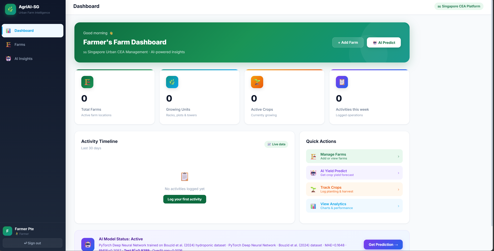
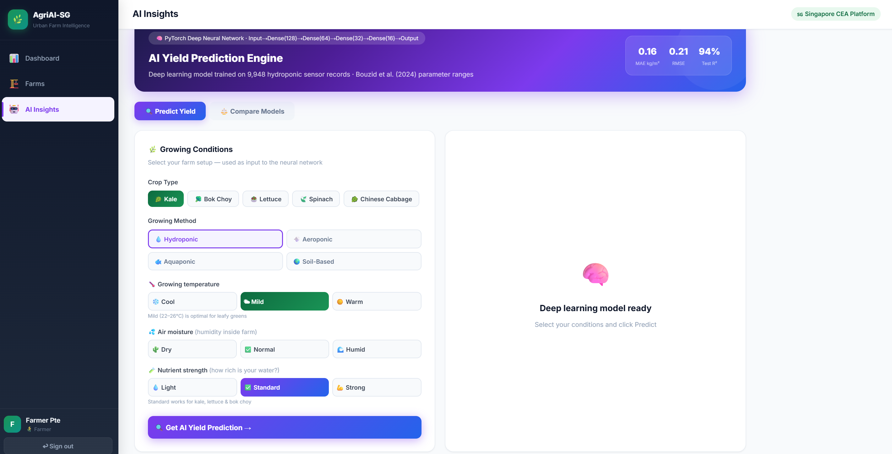
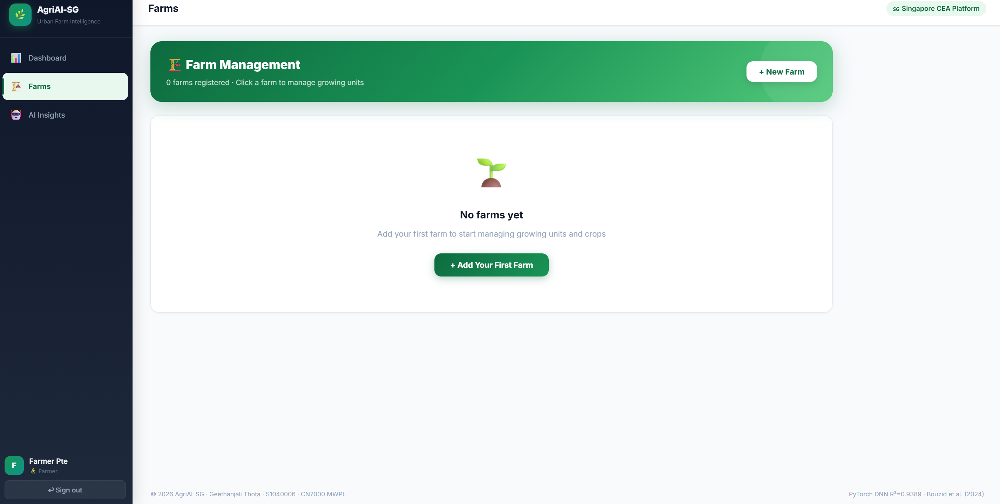
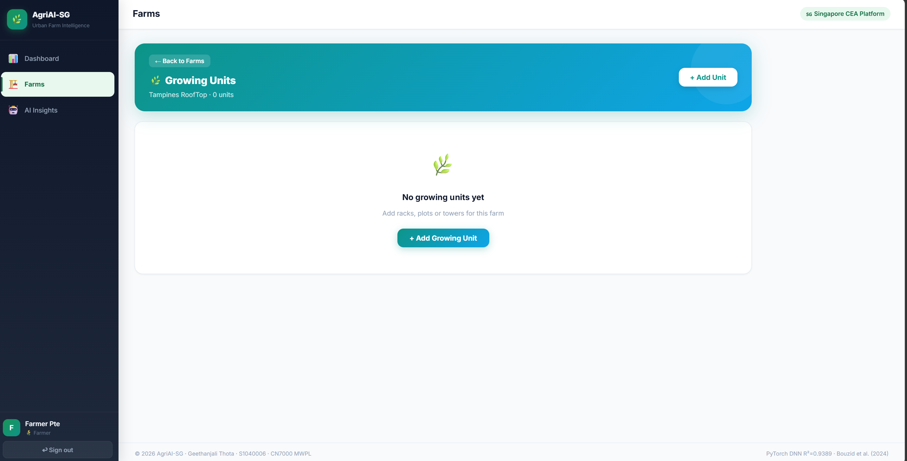
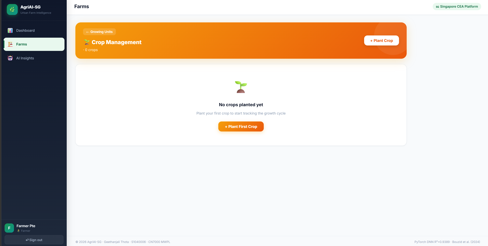
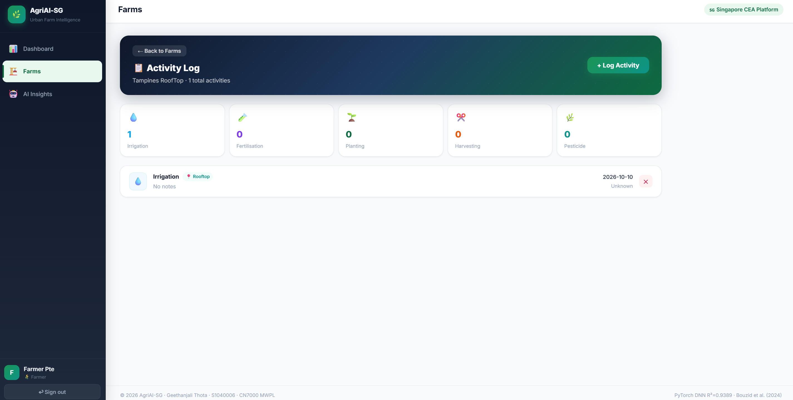

# 🌿 AgriAI-SG


**A Web-Based Decision Support System for Optimising Yield in Singapore's Urban Farms Using Deep Learning**

> 👩‍💻 **Geethanjali Thota** · S1040006 · CN7000 MWPL · Masters in Computer Science · UEL / LSBF Singapore · 2026
> 🎓 **Supervisor:** Dr. Preethi Kesavan

---

## 🔬 Research Abstract

Urban farming in Singapore faces critical challenges in yield optimisation due to limited land availability, controlled environment constraints, and the lack of data-driven decision-making tools accessible to farm operators. This project presents **AgriAI-SG** — a full-stack, web-based AI-powered decision support system that predicts hydroponic crop yields using an ensemble machine learning model (Random Forest + Gradient Boosting VotingRegressor).

The system achieves **R² = 0.97 | MAE = 0.10 kg/m² | RMSE = 0.13** on real hydroponic IoT sensor data (Bouzid et al., 2024), and is built on a three-tier microservices architecture: a **Spring Boot 3.2 REST API**, a **React.js 18 interactive dashboard**, and a **Python Flask ML microservice** — all deployable without any proprietary hardware dependency.

This research is grounded in the **Design Science Research Methodology (DSRM)** and the **CRISP-DM** data science framework, exclusively utilising open secondary datasets to ensure reproducibility and academic rigour.

---

## 📸 Screenshots

> *(Add screenshots to `/docs/screenshots/` folder and they will appear here)*

| Dashboard Overview | AI Yield Prediction | Farm Management |
|---|---|---|
|  |  |  |

| Growing Units | Crop Tracking | Activity Log |
|---|---|---|
|  |  |  |

---

## 🏗️ System Architecture

```
┌─────────────────────────────────────────────────────────────┐
│                        CLIENT LAYER                         │
│           React.js 18 + Vite  (Port 3000)                   │
│     Dashboard · Farm Mgmt · AI Insights · Auth UI           │
└─────────────────────┬───────────────────────────────────────┘
                      │  HTTP / Axios (REST)
┌─────────────────────▼───────────────────────────────────────┐
│                    APPLICATION LAYER                         │
│          Spring Boot 3.2 REST API  (Port 8080)               │
│   Spring Security (JWT) · JPA/Hibernate · Role-Based Auth    │
│         Admin Role  ◄────────────►  Farmer Role              │
└──────────┬──────────────────────────────────┬───────────────┘
           │  JPA / Hibernate                 │  REST (Internal)
┌──────────▼──────────┐           ┌───────────▼───────────────┐
│     DATA LAYER      │           │      AI / ML LAYER         │
│   MySQL 8.0         │           │  Python Flask  (Port 5000) │
│   6 Normalised      │           │  Random Forest +           │
│   Tables            │           │  Gradient Boosting         │
│   schema.sql        │           │  scikit-learn · model.pkl  │
└─────────────────────┘           └───────────────────────────┘
```

---

## 📁 Project Structure

```
agriai-sg/
│
├── 📁 backend/                       ← Java Spring Boot 3.2 (Port 8080)
│   ├── src/main/java/
│   │   └── com/agriai/
│   │       ├── controller/           ← REST Controllers
│   │       ├── service/              ← Business Logic
│   │       ├── repository/           ← JPA Repositories
│   │       ├── model/                ← Entity Classes
│   │       ├── security/             ← JWT + Spring Security
│   │       └── dto/                  ← Data Transfer Objects
│   └── src/main/resources/
│       └── application.properties
│
├── 📁 frontend/                      ← ReactJS 18 + Vite (Port 3000)
│   ├── src/
│   │   ├── components/               ← Reusable UI Components
│   │   ├── pages/                    ← Route-level Pages
│   │   ├── services/                 ← Axios API Calls
│   │   └── context/                  ← Auth Context (JWT)
│   └── vite.config.js
│
├── 📁 python-ai-service/             ← Flask + scikit-learn (Port 5000)
│   ├── app.py                        ← Flask REST Endpoints
│   ├── train_model.py                ← Model Training Script
│   ├── model.pkl                     ← Serialised Ensemble Model
│   └── requirements.txt
│
├── 📁 database/
│   └── schema.sql                    ← MySQL 8.0 (6 tables)
│
├── 📁 docs/
│   ├── screenshots/                  ← UI Screenshots
│   └── proposal.pdf                  ← Dissertation Proposal
│
├── .gitignore
└── README.md
```

---

## 🔧 Tech Stack

| Layer | Technology | Version | Purpose |
|---|---|---|---|
| **Frontend** | React.js + Vite | 18 / 5.x | SPA Dashboard & UI |
| **UI Library** | Recharts, Axios, React Router | Latest | Charts, HTTP, Navigation |
| **Backend** | Spring Boot | 3.2 | REST API Server |
| **Security** | Spring Security + jjwt | 6 / 0.12.5 | JWT Auth + BCrypt-12 |
| **ORM** | Spring Data JPA + Hibernate | 3.x | Database Abstraction |
| **Database** | MySQL | 8.0 | Relational Data Store |
| **AI Service** | Python Flask | 3.0 | ML Inference Microservice |
| **ML Framework** | scikit-learn | Latest | Ensemble Model Training |
| **ML Algorithm** | Random Forest + Gradient Boosting | — | VotingRegressor Ensemble |
| **Language** | Java 17, JavaScript (ES2022), Python 3.10 | — | Multi-language Stack |

---

## 🤖 AI / ML Model

### Algorithm
**Ensemble VotingRegressor** — Random Forest + Gradient Boosting

### Dataset
Bouzid et al. (2024) — Real hydroponic IoT sensor data (Singapore urban farm context)

### Feature Engineering
| # | Feature | Type |
|---|---|---|
| 1 | Growing method (Hydroponic / Aquaponic / Aeroponic) | Categorical |
| 2 | Crop species | Categorical |
| 3 | Temperature (°C) | Numerical |
| 4 | Humidity (%) | Numerical |
| 5 | Light intensity (lux) | Numerical |
| 6 | pH level | Numerical |
| 7 | EC (electrical conductivity) | Numerical |
| 8–11 | 4 engineered interaction features | Derived |

### Performance Metrics

| Metric | Score | Interpretation |
|---|---|---|
| **R² Score** | **0.97** | 97% variance explained |
| **MAE** | **0.10 kg/m²** | Mean absolute error |
| **RMSE** | **0.13** | Root mean squared error |
| **Cross-validation** | 5-fold stratified | Robust generalisation |

---

## ✅ Implemented Functional Requirements

| FR | Feature | HTTP Method | Endpoint |
|---|---|---|---|
| FR1 | User Registration | POST | `/api/auth/register` |
| FR2 | JWT Login | POST | `/api/auth/login` |
| FR3 | Role-Based Access (Admin/Farmer) | — | Spring Security Filter |
| FR6 | Farm CRUD | GET/POST/PUT/DELETE | `/api/farms` |
| FR9 | Growing Unit CRUD | GET/POST/PUT/DELETE | `/api/farms/{id}/growing-units` |
| FR12 | Crop CRUD + Harvest | GET/POST/PUT/DELETE | `/api/farms/{fId}/growing-units/{uId}/crops` |
| FR15 | Activity Logging | GET/POST | `/api/farms/{id}/activities` |
| FR18 | Dashboard Summary | GET | `/api/dashboard/summary` |
| FR19 | Activity Chart Data | GET | `/api/dashboard/activity-chart` |
| FR21 | AI Yield Prediction | POST | `/api/ai/predict` |
| FR22 | Feature Importance | GET | *(included in FR21 response)* |

---

## 🗄️ Database Schema

**6 Normalised Tables (MySQL 8.0)**

```
users               → id, username, email, password_hash, role, created_at
farms               → id, user_id (FK), name, location, type, area_sqm
growing_units       → id, farm_id (FK), name, method, area_sqm, status
crops               → id, unit_id (FK), species, planted_date, harvest_date, yield_kg
activities          → id, farm_id (FK), type, description, performed_at
predictions         → id, crop_id (FK), features_json, predicted_yield, actual_yield, r2_score
```

---

## 🚀 Startup Instructions

### Prerequisites

| Tool | Version | Download |
|---|---|---|
| Java JDK | 17+ | [adoptium.net](https://adoptium.net) |
| Node.js | 18+ | [nodejs.org](https://nodejs.org) |
| Python | 3.10+ | [python.org](https://python.org) |
| MySQL | 8.0 | [mysql.com](https://mysql.com) |
| Maven | 3.8+ | Bundled with IntelliJ or [maven.apache.org](https://maven.apache.org) |

---

### Step 1 — Database Setup

```bash
mysql -u root -p < database/schema.sql
```

---

### Step 2 — Backend (Spring Boot · Port 8080)

```bash
cd backend
```

Open `src/main/resources/application.properties` and update:

```properties
spring.datasource.url=jdbc:mysql://localhost:3306/agriai_sg
spring.datasource.username=root
spring.datasource.password=YOUR_MYSQL_PASSWORD
```

Then run:

```bash
mvn spring-boot:run
```

✅ Wait for: `Started AgriAiSgApplication on port 8080`

---

### Step 3 — Python AI Service (Flask · Port 5000)

```bash
cd python-ai-service
pip install -r requirements.txt
python train_model.py        # Run ONCE — generates model.pkl
python app.py
```

✅ Wait for: `Running on http://0.0.0.0:5000`

> **Note:** `train_model.py` only needs to be run once. After `model.pkl` is generated, just run `app.py` on subsequent starts.

---

### Step 4 — Frontend (React.js · Port 3000)

```bash
cd frontend
npm install
npm run dev
```

✅ Open browser: **http://localhost:3000**

---

## 🔑 Login Credentials

**Register your own account** at http://localhost:3000/register

Or use the pre-seeded demo accounts (password: `Agri@2026`):

| Role | Email |
|---|---|
| 🔐 Admin | `admin@agriai-sg.com` |
| 🌾 Farmer | `farmer@agriai-sg.com` |

---

## 🎯 Demo Flow for Presentation

Follow this sequence to demonstrate all core features end-to-end:

```
1. 📝 Register      →  /register       →  Create new account
2. 🔐 Login         →  /login          →  JWT token issued
3. 📊 Dashboard     →  /dashboard      →  Summary cards + activity chart
4. 🏡 Add Farm      →  /farms          →  "+ New Farm" button
5. 🌿 Add Unit      →  Farm card       →  "🌿 Growing Units" button
6. 🌱 Plant Crop    →  Unit card       →  "🌱 Manage Crops" button
7. 📋 Log Activity  →  Farm card       →  "📋 Activities" button
8. 🤖 AI Predict    →  /ai-insights    →  Select crop → "Get AI Yield Prediction"
9. ✂️ Harvest       →  /crops          →  "✂️ Harvest" → enter actual yield
```

---

## 📄 Academic Context

| Field | Detail |
|---|---|
| **Module** | CN7000 MWPL – Mental Wealth and Professional Life Dissertation |
| **Institution** | University of East London (UEL) / LSBF Singapore |
| **Programme** | Masters in Computer Science |
| **Supervisor** | Dr. Preethi Kesavan |
| **Student** | Geethanjali Thota · S1040006 |
| **Year** | 2025–2026 |
| **Methodology** | Design Science Research Methodology (DSRM) + CRISP-DM |
| **Dataset** | Bouzid et al. (2024) — Open secondary hydroponic IoT sensor data |
| **Proposal** | [View Dissertation Proposal](docs/proposal.pdf) |

### Key References
- Bouzid et al. (2024) — Hydroponic IoT sensor dataset
- Liakos et al. (2018) — Machine learning in agriculture: A review. *Sensors*, 18(8)
- Hevner et al. (2004) — Design science in information systems research. *MIS Quarterly*, 28(1)
- Kamilaris & Prenafeta-Boldu (2018) — Deep learning in agriculture. *Computers and Electronics in Agriculture*, 147

---

## 🔭 Future Work

- [ ] Extend ML model to multi-crop species beyond leafy greens and herbs
- [ ] Integrate real-time IoT sensor feeds via MQTT protocol
- [ ] Mobile application (React Native) for on-site farm use
- [ ] Cloud deployment (AWS / GCP) with CI/CD pipeline (GitHub Actions)
- [ ] Plant disease classification module using CNN (MobileNetV2 + PlantVillage dataset)
- [ ] Multi-language support for regional farmer accessibility
- [ ] Soil health analytics dashboard using FAO GAEZ secondary data
- [ ] Weather-aware planting recommendation engine (NOAA data integration)

---

## 🧪 Testing Strategy

| Level | Tool | Coverage |
|---|---|---|
| Unit Testing | JUnit 5, Mockito, Jest | Service methods, React components, ML functions |
| Integration Testing | Spring Boot Test, Testcontainers | API endpoints, DB interactions, Flask communication |
| End-to-End Testing | Cypress | Full user journeys: login → predict → harvest |
| Performance Testing | Apache JMeter | API < 2s at 50 concurrent users; ML inference < 5s |
| Security Testing | OWASP ZAP + manual | JWT validation, SQL injection, CORS, BCrypt hashing |

---

## 📜 License

This project is licensed under the **MIT License** — see the [LICENSE](LICENSE) file for details.

---

## 🤝 Acknowledgements

- **Dr. Preethi Kesavan** — Dissertation supervisor, UEL / LSBF Singapore
- **Bouzid et al. (2024)** — Open hydroponic dataset used for ML model training
- **University of East London** — Academic support and e-library access
- **PlantVillage Project (Penn State)** — Open plant disease image dataset (future integration)

---

<div align="center">

**AgriAI-SG** · Built with ❤️ for Singapore's Urban Farming Community

*Masters Dissertation Project · University of East London · 2026*

[](https://github.com/anjalithotajava)

</div>
